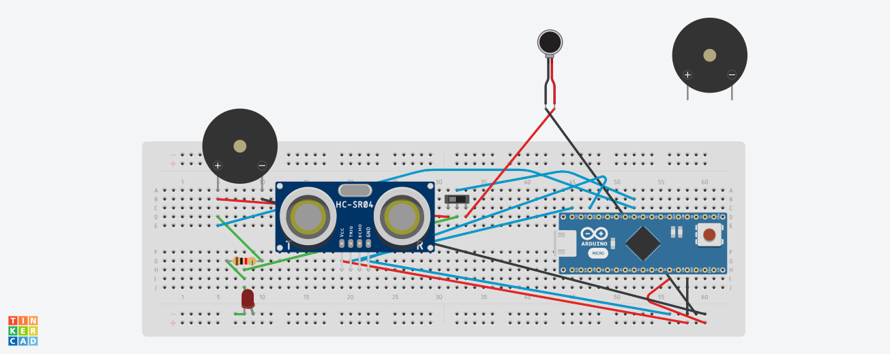

# Third Eye for the Blind
Third eye for the blind is an innovation that allows blind individuals to navigate with more speed and confidence by detecting adjacent impediments with ultrasonic waves and alerting them with a buzzer sound or vibration. They merely have to wear it like a band or cloth. This is the very first wearable technology that solves the problems of all the existing technology available for blind people.

<!-- Replace this text with a brief description (2-3 sentences) of your project. This description should draw the reader in and make them interested in what you've built. You can include what the biggest challenges, takeaways, and triumphs from completing the project were. As you complete your portfolio, remember your audience is less familiar than you are with all that your project entails! -->

<!-- You should comment out all portions of your portfolio that you have not completed yet, as well as any instructions: -->
 
<!--- This is an HTML comment in Markdown -->
<!--- Anything between these symbols will not render on the published site -->


| **Engineer** | **School** | **Area of Interest** | **Grade** |
|:--:|:--:|:--:|:--:|
| Aarav A | Centennial High School | Mechanical Engineering | Incoming Sophomore


<!-- **Replace the BlueStamp logo below with an image of yourself and your completed project. Follow the guide [here](https://tomcam.github.io/least-github-pages/adding-images-github-pages-site.html) if you need help. -->


  
# Final Milestone

<!-- **Don't forget to replace the text below with the embedding for your milestone video. Go to Youtube, click Share -> Embed, and copy and paste the code to replace what's below.** 

 <iframe width="560" height="315" src="https://www.youtube.com/embed/F7M7imOVGug" title="YouTube video player" frameborder="0" allow="accelerometer; autoplay; clipboard-write; encrypted-media; gyroscope; picture-in-picture; web-share" allowfullscreen></iframe> 

 For your final milestone, explain the outcome of your project. Key details to include are:
- What you've accomplished since your previous milestone
- What your biggest challenges and triumphs were at BSE
- A summary of key topics you learned about
- What you hope to learn in the future after everything you've learned at BSE -->


# Second Milestone

<!-- **Don't forget to replace the text below with the embedding for your milestone video. Go to Youtube, click Share -> Embed, and copy and paste the code to replace what's below.** -->

<iframe width="560" height="315" src="https://www.youtube.com/embed/Sw7pWjcXN4A" title="YouTube video player" frameborder="0" allow="accelerometer; autoplay; clipboard-write; encrypted-media; gyroscope; picture-in-picture; web-share" allowfullscreen></iframe>

For your second milestone, explain what you've worked on since your previous milestone. You can highlight:
- Technical details of what you've accomplished and how they contribute to the final goal
- What has been surprising about the project so far
- Previous challenges you faced that you overcame
- What needs to be completed before your final milestone -->
For my second milestone, I switched from working on a perfboard and soldering everything to a mini solderless breadboard. I found this was much easier to get the parts working and the functionality and the layout was pretty much the same as I did with the original breadboard from my first milestone. With this breadboard though, I am able to put the velcro arm strap on and achieve full functionality without a computer. One of the major challenges working with a perfboard was that sometimes the copper circles of the pins would get blackened or burned and then it was very difficult for solder to stick the pin or wire to the board. Also since my project had lots of parts and components on the board, it was sometimes difficult to trace a path for wires to connect to different parts because another part would block its path since everything was close together. This is also one of the reasons I switched to a mini version of the solderless breadboard. For my  third milestone I will finish the entire project complete with the arm band for wearing and achieve full functionality without the need of a computer nearby.


# First Milestone

<!-- **Don't forget to replace the text below with the embedding for your milestone video. Go to Youtube, click Share -> Embed, and copy and paste the code to replace what's below.** -->

<iframe width="560" height="315" src="https://www.youtube.com/embed/8HwbUDoXf-s" title="YouTube video player" frameborder="0" allow="accelerometer; autoplay; clipboard-write; encrypted-media; gyroscope; picture-in-picture; web-share" allowfullscreen></iframe>


<!-- For your first milestone, describe what your project is and how you plan to build it. You can include:
- An explanation about the different components of your project and how they will all integrate together
- Technical progress you've made so far
- Challenges you're facing and solving in your future milestones
- What your plan is to complete your project -->


 I was able to make the base circuit diagram and wire all the parts such as the arduino, LED, Ultrasonic Sensor, and the switch all together and get it to work. The 5 V pin of the arduino is connected to the positive end of the breadboard, while the GND pin is connected to the negative or ground end of the breadboard. The VCC pin of the Ultrasonic sensor is connected to the 5 V pin through the positive end of the breadboard. The GND pin of the sensor is connected to the GND of the arduino through the negative end. The Trig and Echo pins of the sensor are directly connected to pin’s 12 and 10 of the arduino respectively. The short end of the LED is connected on the same column as the Ground/negative end. The other end is in the middle of the board, the resistor is connected to the longer end on the same row. The switch through its middle pin is connected to the same row as the resistor and LED and also pin 5 of the arduino. The Vibration motor’s red or positive end is connected to the third pin of the switch while its negative/ground/blue end is connected to the negative/ground end of the breadboard. Finally, the buzzer's positive end is connected to the first leg of the switch while the negative end is connected to ground. One of the challenges was learning how to connect all the wires from different inputs and devices through the breadboard and making sense of the diagrams. For my next milestone, I will work on getting my parts transferred from the solderless breadboard to the actual perfboard which I will use for the main project.
 
 
 
# Schematics 
<!-- Here's where you'll put images of your schematics. [Tinkercad](https://www.tinkercad.com/blog/official-guide-to-tinkercad-circuits) and [Fritzing](https://fritzing.org/learning/) are both great resoruces to create professional schematic diagrams, though BSE recommends Tinkercad becuase it can be done easily and for free in the browser. -->


# Code
<!-- Here's where you'll put your code. The syntax below places it into a block of code. Follow the guide [here]([url](https://www.markdownguide.org/extended-syntax/)) to learn how to customize it to your project needs. -->

```c++
void setup() {
  // 
   const int pingTrigPin = 12; //Trigger connected to PIN 7   
 const int pingEchoPin = 10; //Echo connected yo PIN 8   
  int buz=5; //Buzzer to PIN 4   
  void setup() {   
  Serial.begin(9600);   
  pinMode(buz, OUTPUT);   
  }   
  
} 

void loop() {
  
    //VISIT : www.robotechmaker.com

  
 long duration, cm;   
  pinMode(pingTrigPin, OUTPUT);   
  digitalWrite(pingTrigPin, LOW);   
  delayMicroseconds(2);   
 digitalWrite(pingTrigPin, HIGH);   
  delayMicroseconds(5);   
  digitalWrite(pingTrigPin, LOW);   
  pinMode(pingEchoPin, INPUT);   
  duration = pulseIn(pingEchoPin, HIGH);   
  cm = microsecondsToCentimeters(duration);   
 if(cm<=50 && cm>0)   
  {   
  int d= map(cm, 1, 100, 20, 2000);   
  digitalWrite(buz, HIGH);   
  delay(100);   
  digitalWrite(buz, LOW);   
  delay(d);  
  }   
  Serial.print(cm);    
  Serial.print("cm");   
  Serial.println();   
  delay(100);   
  }   
  long microsecondsToCentimeters(long microseconds)   
  {   
 return microseconds / 29 / 2;   
  }   

}
```


# Bill of Materials
<!-- Here's where you'll list the parts in your project. To add more rows, just copy and paste the example rows below.
Don't forget to place the link of where to buy each component inside the quotation marks in the corresponding row after href =. Follow the guide [here]([url](https://www.markdownguide.org/extended-syntax/)) to learn how to customize this to your project needs. -->

| **Part** | **Note** | **Price** | **Link** |
|:--:|:--:|:--:|:--:|
| Ultrasonic Sensor| Detects how far an object or obstacle is and sends it to the Arduino | $6.99 | <a href="https://www.amazon.com/WWZMDiB-HC-SR04-Ultrasonic-Distance-Measuring/dp/B0B1MJJLJP/ref=sr_1_3?crid=YPB6JRE05KFT&keywords=wwzmdib+ultrasonic+sensor&qid=1690473183&sprefix=ultrasonic+sensor+WWZ%2Caps%2C98&sr=8-3"> Link </a> |
| Arduino Micro | Acts as main CPU and controls all the sensors and devices. | $19.95 | <a href="https://www.amazon.com/Arduino-Micro-Headers-A000053-Controller/dp/B00AFY2S56/ref=sr_1_3?crid=1QTI1DYT8UBWP&keywords=arduino+micro&qid=1690473005&sprefix=arduino+micro%2Caps%2C140&sr=8-3"> Link </a> |
| Mini Breadboard | Connects all the wiring and components of the third eye device.| $6.49 | <a href="https://www.amazon.com/HiLetgo-SYB-170-Breadboard-Colorful-Plates/dp/B071KCZZ4K/ref=cm_cr_arp_d_product_top?ie=UTF8"> Link </a> |
| Soldering Kit (Optional, if you are doing it on mini solderless breadboard) | Solders the wires to the devices and breadboard and connects them. | $17.99 | <a href="https://www.amazon.com/Soldering-Iron-Kit-Temperature-Desoldering/dp/B07S61WT16/ref=sr_1_5?crid=27OUD0H4OGEGT&keywords=plusivo+soldering+kit&qid=1690477737&sprefix=plusivo%2Caps%2C175&sr=8-5"> Link </a> |
| Switches | Is used to connect the buzzer and vibration motor to the arduino and LED and switches between them | $5.39 | <a href="https://www.amazon.com/HiLetgo-SS-12D00-Toggle-Switch-Vertical/dp/B07RTJDW27/ref=sr_1_3?crid=X9KEUT72TBQ&keywords=HiLetGo+20pcs+Toggle+Switch&qid=1690478463&sprefix=hiletgo+20pcs+toggle+switch%2Caps%2C110&sr=8-3"> Link </a> 
| Resistors | Used to get correct amount of voltage for all the parts. | $5.99 | <a href="https://www.amazon.com/MCIGICM-Values-Resistor-Assortment-Resistors/dp/B06WRQS97C/ref=sr_1_3?crid=3OMOJAVO6BXLV&keywords=mcigicm+30+values+1%25+resistor+assortment&qid=1690488320&sprefix=%2Caps%2C388&sr=8-3"> Link </a> |
| Vibration Motor | Used to vibrate on the users hand when there is an obstacle detected | $11.99 | <a href="https://www.amazon.com/Vibration-Vibrating-Electronic-Computers-Classroom/dp/B09XMWGJNN/ref=sr_1_1?crid=1GUAVJQUGPAGT&keywords=Zard+zoop+mini+coin+vibration+motors&qid=1690488499&sprefix=zard+zoop+mini+coin+vibration+motors%2Caps%2C121&sr=8-1"> Link </a> |
| LED light Diodes | Blinks at a rate depending on how far or close the obstacle is to the sensor. | $6.99 | <a href="https://www.amazon.com/eBoot-Pieces-Emitting-Diodes-Assorted/dp/B06XPV4CSH/ref=sr_1_3?crid=362KS9I3EPI0S&keywords=100%2Bpieces%2Bclear%2Bled%2Blight%2Bemitting%2Bdiodes%2Bbulb%2BLED%2BLamp%2C%2B5%2Bmm&qid=1690488840&sprefix=100%2Bpieces%2Bclear%2Bled%2Blight%2Bemitting%2Bdiodes%2Bbulb%2Bled%2Blamp%2C%2B5%2Bmm%2Caps%2C120&sr=8-3&th=1"> Link </a> |
| Velcro wrap | Used to connect the machinery to the arm and wrist | $7.98 | <a href="https://www.amazon.com/VELCRO-Brand-ONE-WRAP-Double-Sided-Multi-Purpose/dp/B000078CUB/ref=sr_1_4?crid=3826824C56MX2&keywords=Velcro+brand+one-wrap+roll&qid=1690562382&sprefix=velcro+brand+one-wrap+roll%2Caps%2C119&sr=8-4"> Link </a> |
| Digital Multimeter | Used to measure AC and DC current of the electrical components | $9.98 | <a href="https://www.amazon.com/Etekcity-Multimeter-MSR-R500-Electronic-Multimeters/dp/B01N9QW620/ref=sr_1_5?crid=29EJCLP27WK0P&keywords=etekcity%2Bdigital%2Bmultimeter&qid=1690562662&sprefix=Etek%2Bcity%2Bdi%2Caps%2C119&sr=8-5&th=1"> Link </a> |
| Buzzer | Beeps or buzzes a sound when an obstacle is detected, can be used interchangeably with the vibration motor | $6.98 | <a href="https://www.amazon.com/mxuteuk-Electronic-Computers-Printers-Components/dp/B07VK1GJ9X/ref=pd_ybh_a_sccl_15/135-7024201-9911107?pd_rd_w=Iy4Aa&content-id=amzn1.sym.67f8cf21-ade4-4299-b433-69e404eeecf1&pf_rd_p=67f8cf21-ade4-4299-b433-69e404eeecf1&pf_rd_r=177E5D08QXZJBF5JVNMD&pd_rd_wg=9gWJ3&pd_rd_r=6b08c30d-9c3c-447b-a787-d58c98a6d304&pd_rd_i=B07VK1GJ9X&psc=1"> Link </a> |
| Battery Pack | Used for powering the arduino to run the project | $17.99 | <a href="https://www.amazon.com/Anker-PowerCore-Ultra-Compact-High-Speed-Technology/dp/B01CU1EC6Y/ref=sr_1_15?crid=2S0KF249UAC91&keywords=anker+power+bank&qid=1691435107&sprefix=Ankekr+%2Caps%2C229&sr=8-15"> Link </a>|

Total Cost of all the Parts: $124.41


<!-- - [Example 2](https://sviatil0.github.io/Sviatoslav_BSE/)
- [Example 3](https://arneshkumar.github.io/arneshbluestamp/)

To watch the BSE tutorial on how to create a portfolio, click here. -->
